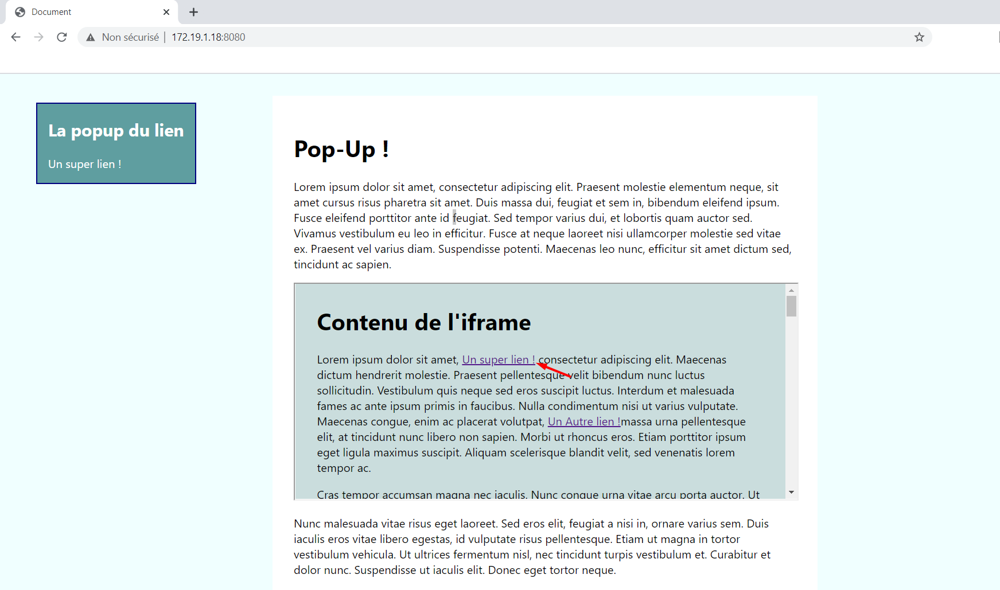

# TP : Positionnement d'un pop-in

Le but est de modifier [popup.js](js/popup.js) pour positionner la popup
à proximité du lien cliqué, en tenant compte du scroll dans et en dehors de l'iframe.

## Fichiers du projet

| Fichier | Description |
|---------|-------------|
| [css/style.css](css/style.css) | La feuille de style |
| [frame.html](frame.html) | Le document à l'intérieur de l'iframe. |
| [index.html](index.html) | Le document principal |
| [js/popup.js](js/popup.js) | Le Javascript. Il est est appellé par [frame.html](frame.html) |

## Lancement du serveur

lancer `npm install` puis `npm start` à la racine du projet.

## Et Voilà !

